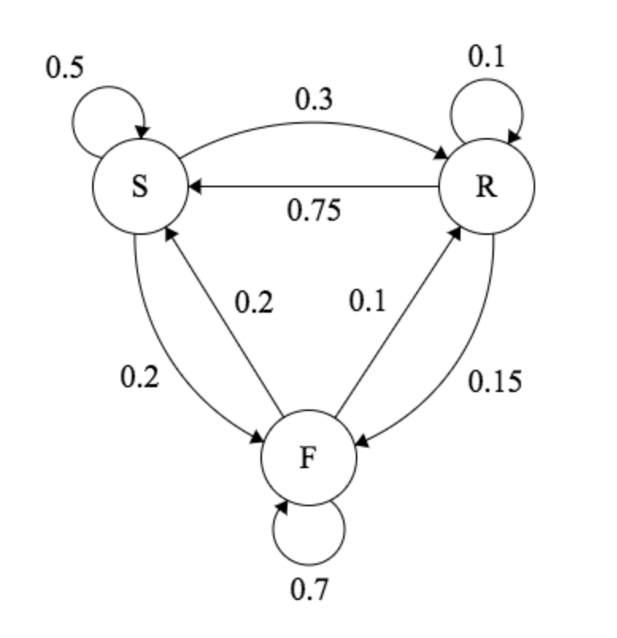

# Introduction

Algorithms in the Q learning family learn a mapping from action-state pairs to an expected reward, the so called Q function. Classical Q-learning algorithms store this information in a tabular form whose memory complexity and non-linearly growing size make problems with large state spaces infeasible, e.g.: playing video games from video input. We will look at how deep Q-learning helps mitigate this problem.

We will start this article by remembering some concepts and formalizing the problem as a Markov Decision Process which will be important in understanding the assumptions behind the Q-learning algorithm.

# Markov Decision Process

Physical processes are inherently causal, so far there is no forward dependency in time (we haven't invented the time machine yet!). A physical process or system, can be seen as transitions between so called states. States are unique representations of a systems internal parameters, e.g.: position, velocity or a discrete identifier.

Markov Processes take this assumption one step further and satisfy the Markovian property: **The conditional probability distribution of future states of the process depends only upon the present state, not on the sequence of events that preceded it.**

A Markov process is defined by a set of states and their transitions together with the respective probabilities of occurrence. The agent interacts with this process by choosing his actions and receives rewards if goals are achieved. In the above image you can see a visual representation of a discrete markov decision process with three states (S, R and F) and the respective transition probabilities.

# Q-Learning

Going quickly over some important notions, the objective of algorithms in the Q-learning family is to **learn a mapping between a state-action pair $(s, a)$ and the corresponding expected future reward $Q(s, a)$.** This function allows us to interact with the environment, maximizing the future expected reward at every step.

The Markovian property, introduced in the previous section, is important in Q-Learning since it means the state-action pairs are independent of the past sequence of events. That is, $Q(a, s)$ only depends on the current state and the action. 

For discrete systems, the function's values can be stored in tabular form with dimensions $S \times A$. This table is initialized with zeros and filled with an iterative algorithm called Q-learning.

The algorithm starts with exploring the environment through the so called exploitation vs discovery trade off, that is, it selects either a random action with probability $\epsilon$ or one that maximizes the stored Q-table. After executing the action, the update step depends on the returned reward to adjust the Q table. If you have not yet studied the classic Q-learning algorithm I strongly encourage you to understand the concepts in the tabular algorithm first. [[1](https://joshgreaves.com/reinforcement-learning/understanding-rl-the-bellman-equations/)].

The most important part of this algorithm is the update equation for the Q table:

$Q^{t+1}(s_t, a_t) \Leftarrow (1-\alpha)\cdot Q^t(s_t, a_t) + \alpha \cdot (r_t + \gamma\cdot max_a Q^t(s_{t+1}, a_t))$

This expression is a so called running mean and, as we will now see, is very similar to the gradient descent update common in machine learning. Rewriting this expression slightly the equation becomes:

$Q^{t+1}(s_t, a_t) \Leftarrow Q^t(s_t, a_t) + \alpha \cdot (r_t + \gamma\cdot max_a Q^t(s_{t+1}, a_t)-Q^t(s_t, a_t))$

If we substitute $r_t + \gamma\cdot max_a Q^t(s_{t+1}, a)$ by an auxiliary function called $target(r_t, Q^t(s_{t+1}, a_t)$ we can see that the expression simplifies to:

$Q^{t+1}(s_t, a_t) \Leftarrow Q^t(s_t, a_t) + \alpha \cdot (target(r_t, Q^t(s_{t+1}, a_t))-Q^t(s_t, a_t))$ 

The last equation **can be seen as a gradient descent optimization if we interpret $target(r_t, s_{t+1}, Q^t)-Q(s_{t})$ as an error term**, rewriting the expression as:

$Q^{t+1}(s_t, a_t) \Leftarrow Q^t(s_t, a_t) + \alpha \cdot e^t$

By this point we are starting to see how **we will be able to generalize the q-learning algorithm in the tabular form to a function approximation**. 

In the next section we will integrate the two pieces and show how we are able to tackle large and continuous state spaces.

# Q-Function Approximation

In the previous section we saw that classical Q learning algorithms store the Q function in a tabular form. This tabular form makes large state spaces infeasible as the memory grows non-linearly and due to the curse of dimensionality.

Deep Q Learning mitigates this problem by introducing a smoothness prior (Q function approximation). This methodology was proven to be feasible, among others, in Mnih et. al (2013) with the introduction of improvements such as the Experience Replay technique.

Revisiting the rewritten Q update expression from the previous section:

$Q^{t+1}(s_t, a_t) \Leftarrow Q^t(s_t, a_t) + \alpha \cdot e^t$

In this expression the Q function is stored in tabular form, but could we not use a parameterized function to store the same information? Instead of storing the value of the Q function in a table and index it with the state-action pairs, couldn't we calculate them using a function?

Yes we can! (but there are some caveats we have to deal with first!)

Lets not get ahead of ourselves, we just saw that we can update our Q function using something similar to gradient descent. What would happen if we substituted the Q function with a smooth parameterized function? Starting with an expression we arrived at earlier but substituting it with a parameterized $Q$ function with parameters $\theta$: 

$Q_\theta^{t+1}(s_t, a_t) \Leftarrow Q_\theta^t(s_t, a_t) + \alpha \cdot (target(r_t, Q_\theta^t(s_{t+1}, a_t))-Q_\theta^t(s_t, a_t))$

Since $Q_\theta^t$ is smooth we can rewrite this expression as a gradient descent on a squared error cost function:

$Q_\theta^{t+1}(s_t, a_t) \Leftarrow Q_\theta^t(s_t, a_t) + \alpha \cdot \nabla_\theta C$

Where C is defined by:

$C = \left(target(r_t, Q_\theta^t(s_{t+1}, a_t))-Q_\theta^t(s_t, a_t)\right)^2$

Comparing this with a supervised learning squared error function:

$C= \left(y - \hat y\right)^2$

we can see that we can interpret the reference value as the measured reward and the estimated value as the reward estimated by our network. That is:

$y = target(r_t, Q_\theta^t(s_{t+1}, a_t)) \quad \quad \quad \hat y = Q_\theta^t(s_t, a_t)$

Which looks great, we were able to transform the problem into a supervised learning setting! Before we celebrate there are two important things we have to deal with: trajectory sample correlation and unbounded reward due to self following.

# Experience Replay

Stochastic gradient descent optimization requires samples to be uncorrelated, or in other words, if you feed a neural network more images of cats then dogs it creates natural bias towards cats.

The same is true for Q-learning function approximators, if consecutive samples are drawn from the same trajectory the resulting Q-function is skewed in favor of this trajectory.

Another issue related to this approach is the forgetting of old trajectories as new ones overwrite the functions weights.

Experience replay seeks to mitigate these two issues by keeping a buffer of experienced trajectories. The samples for the q-function update step are then sampled from this buffer instead of directly from experience. This helps de-correlate samples and remember old trajectories.

# Non-Stationary Reference

As we have seen in previous sections, the reference value is non-stationary, that is, the target value depends directly on $Q_\theta^t(s_{t+1}, a_t)$.

This stands in contrast to classical supervised learning approaches where the reference is a fixed label. Here the network follows a reference which is changing in time.

A common approach to overcoming this problem is to freeze the target network for a given number of samples while updating a training network and after the number of steps synchronizing the weights between the two networks.

This allows us to somewhat stabilize the reference value and avoid some common pitfalls in this kind of training.

# Conclusion

In this article we started by introducing the Markov Decision Process problem and showing the importance of its assumptions in the Q-learning algorithm.

Afterwards we gave a short overview of the Q-learning algorithm before moving on to showing how we can generalize the tabular Q-learning to a function approximator.

We were able to demonstrate how to arrive at the update formulas for the Q-learning algorithm with a function approximator and introduced some common pitfalls in the training procedure and how to avoid them.

In the next article we will look at how to implement the algorithm from scratch in PyTorch!

Stay tuned for updates by staring [this](https://github.com/pschydlo/RLenv.directory) repository!

Curious to apply some of these algorithms on different environments? Then you have come to the right place!

Explore our database of 100+ open source reinforcement learning environments at [RLenv.directory](/)! :-)